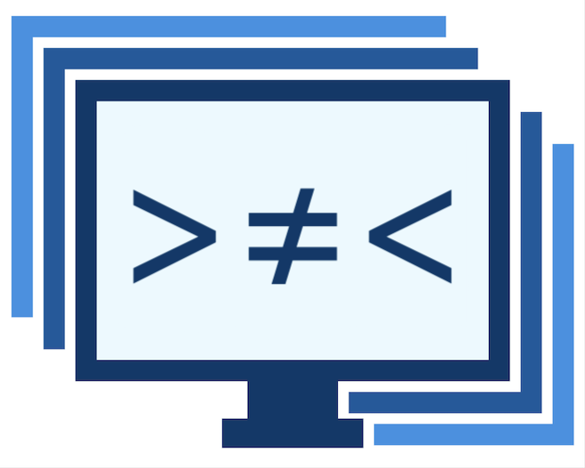

# dcs-file-version-diff-tool

<div id="top"></div>
<!--
*** Thanks for checking out the Best-README-Template. If you have a suggestion
*** that would make this better, please fork the repo and create a pull request
*** or simply open an issue with the tag "enhancement".
*** Don't forget to give the project a star!
*** Thanks again! Now go create something AMAZING! :D
-->

<!-- PROJECT SHIELDS -->
<!--
*** I'm using markdown "reference style" links for readability.
*** Reference links are enclosed in brackets [ ] instead of parentheses ( ).
*** See the bottom of this document for the declaration of the reference variables
*** for contributors-url, forks-url, etc. This is an optional, concise syntax you may use.
*** https://www.markdownguide.org/basic-syntax/#reference-style-links
-->

[![Contributors][contributors-shield]][contributors-url]
[![Forks][forks-shield]][forks-url]
[![Stargazers][stars-shield]][stars-url]
[![Issues][issues-shield]][issues-url]
[![MIT License][license-shield]][license-url]

<!-- PROJECT LOGO -->
<br />
<div align="center">
  <a href="https://github.com/unfoldingword-box3/dcs-file-version-diff-tool">
    
  </a>

<h3 align="center">dcs-file-version-diff-tool</h3>

  <p align="center">
    A diff tool to compare two versions of a file between branches and/or repositories.
    <br />
    <a href="https://github.com/unfoldingword-box3/dcs-file-version-diff-tool"><strong>Explore the docs »</strong></a>
    <br />
    <br />
    <a href="https://dcs-file-version-diff-tool.netlify.app/">View Demo</a>
    ·
    <a href="https://github.com/unfoldingword-box3/dcs-file-version-diff-tool/issues">Report Bug</a>
    ·
    <a href="https://github.com/unfoldingword-box3/dcs-file-version-diff-tool/issues">Request Feature</a>
  </p>
</div>

<!-- TABLE OF CONTENTS -->
<details>
  <summary>Table of Contents</summary>
  <ol>
    <li>
      <a href="#about-the-project">About The Project</a>
      <ul>
        <li><a href="#built-with">Built With</a></li>
      </ul>
    </li>
    <li>
      <a href="#getting-started">Getting Started</a>
      <ul>
        <li><a href="#prerequisites">Prerequisites</a></li>
        <li><a href="#installation">Installation</a></li>
      </ul>
    </li>
    <li><a href="#usage">Usage</a></li>
    <li><a href="#roadmap">Roadmap</a></li>
    <li><a href="#contributing">Contributing</a></li>
    <li><a href="#license">License</a></li>
    <li><a href="#contact">Contact</a></li>
    <li><a href="#acknowledgments">Acknowledgments</a></li>
  </ol>
</details>

<!-- ABOUT THE PROJECT -->

## About The Project

[![Product Name Screen Shot][product-screenshot]](https://example.com)

**Purpose**

- The purpose of this project

**Problem**

- The problem statement

**Scope**

- What's in scope and out of scope for this project?

**Background**

- What led us to this point? How did we get here?

Here's a blank template to get started: To avoid retyping too much info. Do a search and replace with your text editor for the following: `unfoldingword-box3`, `dcs-file-version-diff-tool`, `twitter_handle`, `linkedin_username`, `email`, `email_client`, `dcs-file-version-diff-tool`, `A diff tool to compare two versions of a file between branches and/or repositories.`

<p align="right">(<a href="#top">back to top</a>)</p>

### Built With

- [React.js](https://reactjs.org/)

<p align="right">(<a href="#top">back to top</a>)</p>

<!-- GETTING STARTED -->

## Getting Started

This is an example of how you may give instructions on setting up your project locally.
To get a local copy up and running follow these simple example steps.

### Prerequisites

**Data**
what is the source of the data and data formats are covered by this project?

This is an example of how to list things you need to use the software and how to install them.

- npm
  ```sh
  npm install npm@latest -g
  ```

### Installation/First Steps

1. Get a free API Key at [https://example.com](https://example.com)
2. Clone the repo
   ```sh
   git clone https://github.com/unfoldingword-box3/dcs-file-version-diff-tool.git
   ```
3. Install NPM packages
   ```sh
   npm install
   ```
4. Enter your API in `config.js`
   ```js
   const API_KEY = "ENTER YOUR API";
   ```

<p align="right">(<a href="#top">back to top</a>)</p>

<!-- USAGE EXAMPLES -->

## Usage/Integration

Use this space to show useful examples of how a project can be used. Additional screenshots, code examples and demos work well in this space. You may also link to more resources.

_For more examples, please refer to the [Documentation](https://example.com)_ Possibly JS Docs.

[Styleguidist link](https://example.netlify.app)

<p align="right">(<a href="#top">back to top</a>)</p>

<!-- ROADMAP -->

## Roadmap

- [] Feature 1
- [] Feature 2
- [] Feature 3
  - [] Nested Feature

See the [open issues](https://github.com/unfoldingword-box3/dcs-file-version-diff-tool/issues) for a full list of proposed features (and known issues).

<p align="right">(<a href="#top">back to top</a>)</p>

<!-- CONTRIBUTING -->

## Contributing

Contributions are what make the open source community such an amazing place to learn, inspire, and create. Any contributions you make are **greatly appreciated**. [Guidelines for external contributions.](https://forum.door43.org)

You can also simply open an issue with the tag "enhancement".
Don't forget to give the project a star! Thanks again!

If you would like to fork the repo and create a pull request.

1. Fork the Project
2. Create your Feature Branch (`git checkout -b feature/AmazingFeature`)
3. Commit your Changes (`git commit -m 'Add some AmazingFeature'`)
4. Push to the Branch (`git push origin feature/AmazingFeature`)
5. Open a Pull Request

<p align="right">(<a href="#top">back to top</a>)</p>

<!-- LICENSE -->

## License

Distributed under the MIT License. See `LICENSE` for more information.

<p align="right">(<a href="#top">back to top</a>)</p>

<!-- CONTACT -->

## Contact

Your Name - [@twitter_handle](https://twitter.com/twitter_handle) - email@email_client.com

Project Link: [https://github.com/unfoldingword-box3/dcs-file-version-diff-tool](https://github.com/unfoldingword-box3/dcs-file-version-diff-tool)

<p align="right">(<a href="#top">back to top</a>)</p>

<!-- ACKNOWLEDGMENTS -->

## Acknowledgments

- []()
- []()
- []()

<p align="right">(<a href="#top">back to top</a>)</p>

<!-- MARKDOWN LINKS & IMAGES -->
<!-- https://www.markdownguide.org/basic-syntax/#reference-style-links -->

[contributors-shield]: https://img.shields.io/github/contributors/unfoldingword-box3/dcs-file-version-diff-tool.svg?style=for-the-badge
[contributors-url]: https://github.com/unfoldingword-box3/dcs-file-version-diff-tool/graphs/contributors
[forks-shield]: https://img.shields.io/github/forks/unfoldingword-box3/dcs-file-version-diff-tool.svg?style=for-the-badge
[forks-url]: https://github.com/unfoldingword-box3/dcs-file-version-diff-tool/network/members
[stars-shield]: https://img.shields.io/github/stars/unfoldingword-box3/dcs-file-version-diff-tool.svg?style=for-the-badge
[stars-url]: https://github.com/unfoldingword-box3/dcs-file-version-diff-tool/stargazers
[issues-shield]: https://img.shields.io/github/issues/unfoldingword-box3/dcs-file-version-diff-tool.svg?style=for-the-badge
[issues-url]: https://github.com/unfoldingword-box3/dcs-file-version-diff-tool/issues
[license-shield]: https://img.shields.io/github/license/unfoldingword-box3/dcs-file-version-diff-tool.svg?style=for-the-badge
[license-url]: https://github.com/unfoldingword-box3/dcs-file-version-diff-tool/blob/master/LICENSE.txt
[linkedin-shield]: https://img.shields.io/badge/-LinkedIn-black.svg?style=for-the-badge&logo=linkedin&colorB=555
[linkedin-url]: https://linkedin.com/in/linkedin_username
[product-screenshot]: images/screenshot.png
